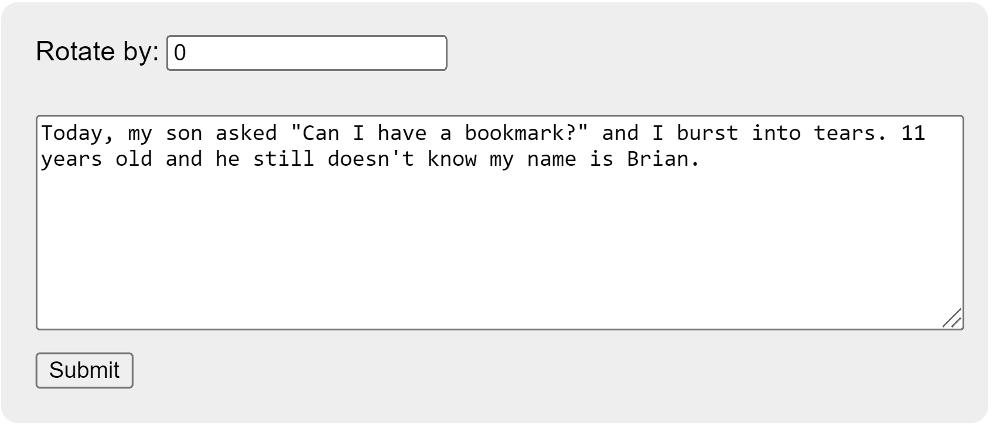
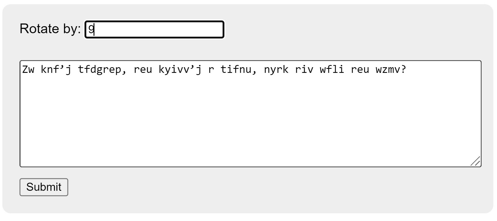
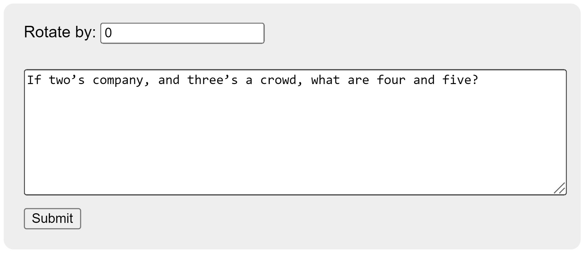
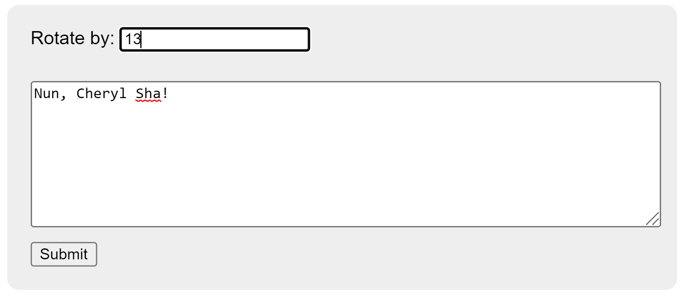
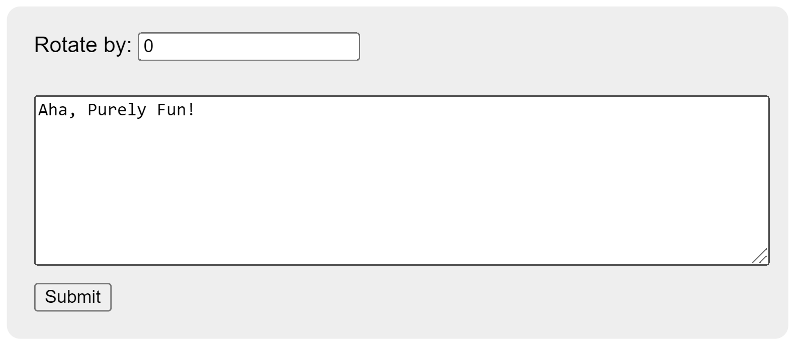

# Web Caesar

## Table of contents

-   [Overview](#overview)
-   [Screenshots](#screenshots)

## Overview

An HTML user form that uses a Python (Flask) backend to return text that has been encrypted using Caesar's cipher. Screenshots of the program can be viewed below.

_This program was created for a homework assignment at LaunchCode's Lc101 (2018)._

## Screenshots

### ROT-1

### ROT9

### ROT13

