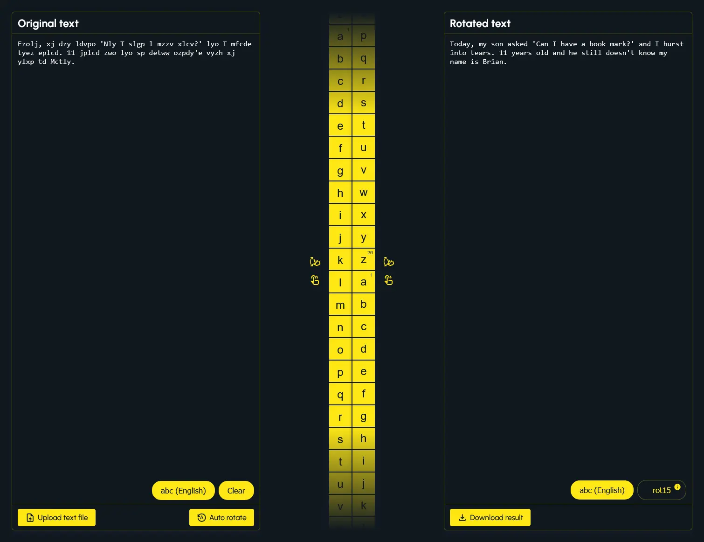

# Web Caesar



[View the web application](https://web-caesar-container-service.tw35szt7qqpz2.us-east-2.cs.amazonlightsail.com/)

## Table of contents

- [Overview](#overview)
  - [Technologies used](#technologies-used)
  - [Caesar's Cipher](#caesars-cipher)
  - [Features](#features)
    - [Supported Languages](#supported-languages-include)
  - [How to use](#how-to-use)
- [How to run locally](#how-to-run-locally)
  - [Run on Docker](#run-on-docker)
  - [Run on Windows](#run-on-windows)
- [Screenshots](#screenshots)
  - [Desktop](#desktop)
  - [Mobile](#mobile)

## Overview

This web application allows the user to encrypt and decrypt text using Caesar's Cipher, starting with a randomly selected dad joke.

### Technologies used

- Python
- TypeScript
- JavaScript
- Flask
- React
- HTML
- CSS
- Vite
- Axios
- Tanstack React Query
- Docker
- pyspellchecker
- react-toastify
- lodash
- gunicorn
- black

### Caesar's Cipher

Caesar's Cipher is a type of substitution cipher in which each letter in the plaintext is shifted (or rotated) a certain number of places down or up the alphabet.

For example, with a rotation of 3:

- `A` would be replaced by `D`
- `B` would become `E`
- `C` would become `F`
- etc...

The method is named after _Julius Caesar_, who used it in his private correspondence.

Here's a simple example:

- Original text: `HELLO`
- Rotation: `3`
- Rotated text: `KHOOR`

To decrypt the message, you would rotate the letters back by the same number.

### Features

The application supports the following features:

- Upload text as `.txt` file
- Download text as `.txt` file
- Automatically decrypt Caesar Cipher encrypted text
- Manually rotate letters by vertically dragging letter columns
- Change the language/alphabet used for original and/or rotated text
- Although not the recommended experience, touch screen and mobile are supported
- Changes are automatically saved to the browser every 2.5 seconds or so (via `localStorage`)

#### Supported languages include

- English
- Spanish
- French
- Portuguese
- German
- Italian
- Russian
- Basque
- Latvian
- Dutch

### How to use

When the app initially loads, the Original Text and Rotated Text are populated with an encrypted, randomly selected dad joke.

The rotation defaults to `0`, from this point the user can either drag one of the two letter columns to rotate the text manually, click the `Auto Detect` button to decrypt and rotate the text via server, or replace the text with their own text.

A `.txt` file can be uploaded to the Original Text by clicking the `Upload text file` button. Rotated Text can be downloaded as a `.txt` file by clicking the `Download result`. Text in the Rotated Text can be clicked to copy to the clipboard (copy to clipboard only works on an HTTPS secured connection).

The alphabet used for Original Text and Rotated Text can be changed by clicking their corresponding `Language icon/button`.

_This program was originally created for a homework assignment at LaunchCode's Lc101 (2018). I have since then updated this project._

# How to run locally

## Run on Docker

Firstly, confirm that Docker is installed and running. Next confirm that no other application is using port `5000` as port `5000` is needed for the Flask server. If you need to run Flask on an alternative port, you can modify the last line in the `application/application.py` and the ports in the `docker-compose.yml` file.

**It is assumed the user is at the root of this project and is using a UNIX style command line environment when referencing the CLI commands below.**

Build Docker image and start Docker container:

```bash
docker compose up --build
```

Visit: <http://localhost:5000> to use the application.

## Run on Windows

Assumes the following:

- You are using a modern Windows client OS such as Windows 11 or Windows 10
- You have Python `3.11` or greater installed
- You have Node `v22.8.0` or greater installed
- You are at the root of this project and are using a UNIX style command line environment when referencing the CLI commands below

Confirm that no other application is using port `5000` as port `5000` is needed for the Flask server. If you need to run Flask on an alternative port, you can modify the last line in the `application/application.py`.

Open terminal at root of this project then run the following command to build the ui:

```bash
cd application/ui/ && npm i && npm run build && cd ..
```

If the previous command was successful, you should now be in the `application` folder. From here, create `venv` folder in application folder using Python 3.11:

```bash
python3.11 -m venv venv
```

Activate venv:

```bash
source venv/Scripts/activate
```

Install python packages to venv:

```bash
pip install -r requirements.txt
```

Start application:

```bash
python application.py
```

Visit: <http://localhost:5000> to use the application.

## Screenshots

### Desktop

###


###


###


###


###


###


###


### Mobile

###


###


###


###


