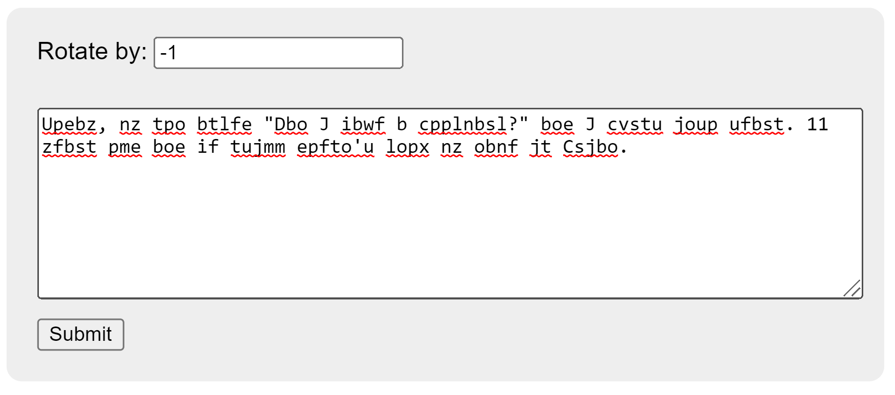

# Web Caesar

## Table of contents

-   [Overview](#overview)
-   [Technologies Used](#technologies-used)
-   [Screenshots](#screenshots)

## Overview

Encrypt and decrypt text using Caesar's cipher. Supports multiple languages.

_This program was created for a homework assignment at LaunchCode's Lc101 (2018)._

## Technologies Used

-   Python
-   TypeScript
-   JavaScript
-   Flask
-   React
-   HTML
-   CSS
-   Vite
-   Axios
-   Tanstack React Query
-   pyspellchecker

## Screenshots

### ROT-1

### ROT9

### ROT13

