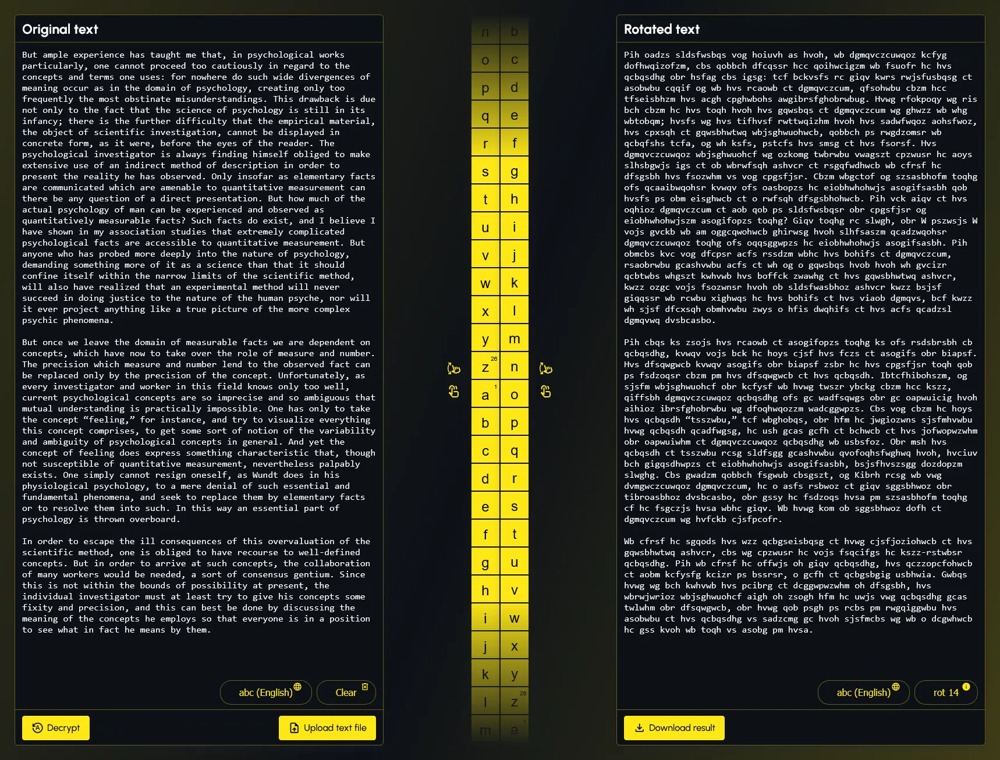

# Web Caesar



## Table of contents

-   [Overview](#overview)
    -   [Supported Languages](#supported-languages-include)
-   [Technologies Used](#technologies-used)
-   [How to run locally](#how-to-run-locally)
    -   [Run on Docker](#run-on-docker)
    -   [Run on Windows](#run-on-windows)
-   [Screenshots](#screenshots)
    -   [Desktop](#desktop)
    -   [Mobile](#mobile)

## Overview

This web application allows the user to encrypt and decrypt text using Caesar's Cipher. The application supports the following features:

-   Upload text as `.txt` file
-   Download text as `.txt` file
-   Automatically decrypt Caesar Cipher encrypted text (works across multiple languages)
-   Manually decrypt or encrypt text (works across multiple languages)

### Supported languages include:

-   English
-   Spanish
-   French
-   Portuguese
-   German
-   Italian
-   Russian
-   Basque
-   Latvian
-   Dutch

_This program was created for a homework assignment at LaunchCode's Lc101 (2018) that I have since then updated._

## Technologies Used

-   Python
-   TypeScript
-   JavaScript
-   Flask
-   React
-   HTML
-   CSS
-   Vite
-   Axios
-   Tanstack React Query
-   Docker
-   pyspellchecker
-   react-toastify
-   lodash
-   black

# How to run locally

## Run on Docker

Firstly, confirm that Docker is installed and running. Next confirm that no other application is using port `5000` as port `5000` is needed for the Flask server. If you need to run Flask on an alternative port, you can modify the last line in the `application/application.py` and the ports in the `docker/docker-compose.yml` file.

**It is assumed the user is at the root of this project and is using a UNIX style command line environment when referencing the CLI commands below.**

Open terminal at root of this project then move into docker/ directory:

```
cd docker/
```

Build Docker image and start Docker container:

```
docker compose up --build
```

Visit: http://localhost:5000 to use the application.

## Run on Windows

Assumes the following:

-   You are using a modern Windows client OS such as Windows 11 or Windows 10
-   You have Python `3.11` or greater installed
-   You have Node `v22.8.0` or greater installed
-   You are at the root of this project and are using a UNIX style command line environment when referencing the CLI commands below

Confirm that no other application is using port `5000` as port `5000` is needed for the Flask server. If you need to run Flask on an alternative port, you can modify the last line in the `application/application.py`.

Open terminal at root of this project then run the following command to build the ui:

```
cd application/ui/ && npm i && npm run build && cd ..
```

If the previous command was successful, you should now be in the `application` folder. From here, create `venv` folder in application folder using Python 3.11:

```
python3.11 -m venv venv
```

Activate venv:

```
source venv/Scripts/activate
```

Install python packages to venv:

```
pip install -r requirements.txt
```

Start application:

```
python application.py
```

Visit: http://localhost:5000 to use the application.

## Screenshots

WIP

### Desktop

### Mobile
